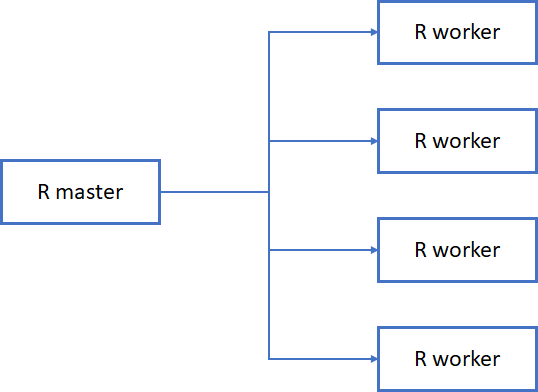
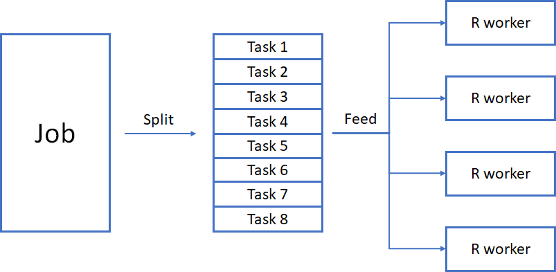
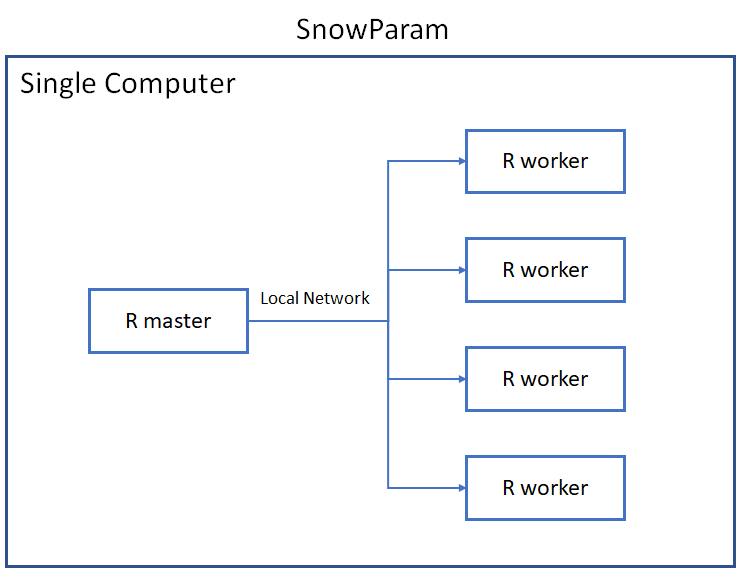
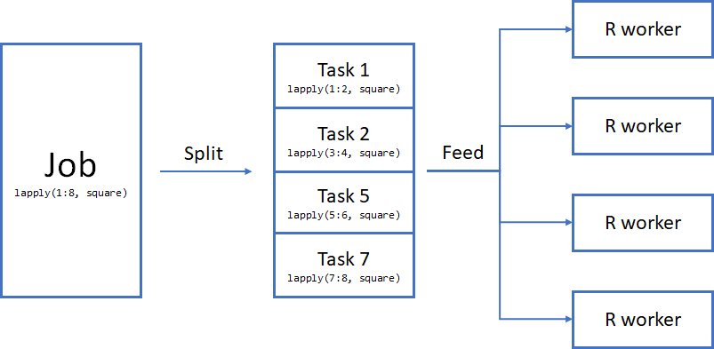
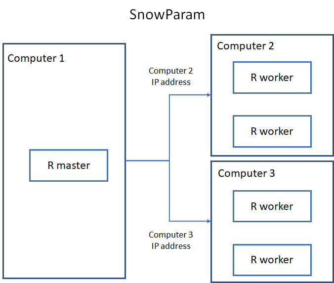
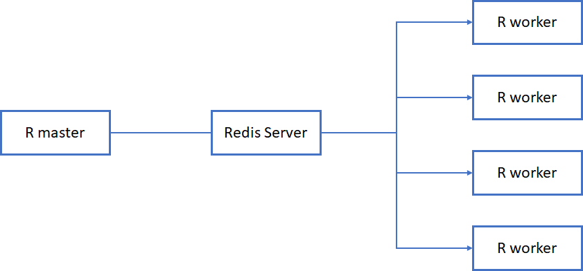
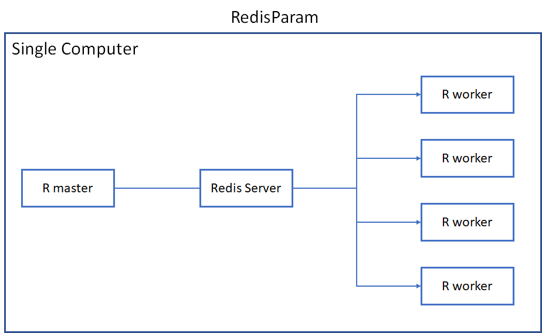
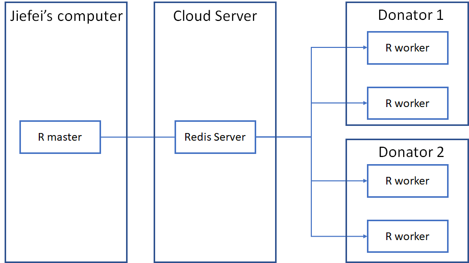

```{r, include = FALSE}
knitr::opts_chunk$set(
  collapse = TRUE,
  comment = "#>",
  eval = TRUE,
  cache = TRUE
)
```

# High-Performance Computing in R for Genomic Research
Authors:
    Jiefei Wang^[University of Texas Medical Branch at Galveston].
    <br/>
Last modified: 12 July, 2023

## Description
In this vignette, we will introduce the basic concepts of parallel computing and how to use parallel computing in R. We will also introduce the BiocParallel package and how to use it to speed up your analysis. This is a lecture + lab workshop, most content in this vignette will be covered in the lecture slides. This vignette serves as a reference for the workshop. In this lecture, no prior knowledge of parallel computing is required, but basic knowledge of R syntax is needed to complete this workshop.


## Participation

To follow the lecture, you can either use your own Rstudio and install the required package, or use the Rstudio cloud at [Bioconductor Workshop Galaxy](https://workshop.bioconductor.org/) (recommended). The Rstudio cloud is free to use, but you need to register an account first.


## _R_ / _Bioconductor_ packages used
1. parallel
1. BiocParallel
2. RedisParam
3. SharedObject
4. delayedXX

## Useful Materials

1. [Introduction to BiocParallel](https://bioconductor.org/packages/release/bioc/vignettes/BiocParallel/inst/doc/Introduction_To_BiocParallel.html)
2. [Random Numbers in BiocParallel](https://bioconductor.org/packages/release/bioc/vignettes/BiocParallel/inst/doc/Random_Numbers.html)
3. [Errors, Logs and Debugging in BiocParallel](https://bioconductor.org/packages/release/bioc/vignettes/BiocParallel/inst/doc/Errors_Logs_And_Debugging.pdf)
4. Jiefei Wang's email: jiewang@utmb.edu (Questions, discussions, and collaborations are welcome)

## Time outline

An example for a 45-minute workshop:

| Activity                     | Time |
|------------------------------|------|
| Introduction                     | 20m  |
| Bioconductor way of Parallalization | 30m   |
| Performance Improvement               | 20m  |
| Debug               | 20m  |
| Practice               | 10m  |

## Workshop goals and objectives

List "big picture" student-centered workshop goals and learning
objectives. Learning goals and objectives are related, but not the
same thing. These goals and objectives will help some people to decide
whether to attend the conference for training purposes, so please make
these as precise and accurate as possible.

*Learning goals* are high-level descriptions of what
participants will learn and be able to do after the workshop is
over. *Learning objectives*, on the other hand, describe in very
specific and measurable terms specific skills or knowledge
attained. The [Bloom's Taxonomy](#bloom) may be a useful framework
for defining and describing your goals and objectives, although there
are others.

## Learning goals
* Understand how parallel computing works
* Understand different parallel computing backend
* Know how to use BiocParallel package to speed up your analysis
* (Advanced) Be able to do build your at-home computing cluster

## Learning objectives

* Run **bplapply** function with different parallel backend
* Connect with a Redis server using RedisParam
* Use BiocParallel to run a permutation algorithm with a backend of your choice


# Introduction
With the recent "core war" between Intel and AMD, two major CPU manufacturers, the number of cores in a CPU has been increasing rapidly. For example, the latest AMD Ryzen 9 7950X equipped with 16 cores and 32 threads. This monster-level CPU provides a huge amount of computing power for performing large-scale data analysis. However, most of the time, we are not using the full power of our CPU as R is desinged as a single-threaded programming language. This design makes R easy to learn and use, but it also limits the computing power of R. In this workshop, we will introduce how to use parallel computing to fully utilize the power of your CPU and build your own at-home computing cluster.

While parallel computing may sound fancy and complicated, it is actually very simple at its core. There are many packages in R that can help you to do parallel computing, but they all share the same basic idea: **split a job into smaller tasks and run them simultaneously**. For example, if you need to perform 1000 additions, you can either do it one by one by yourself, or you can ask 10 friends to do 100 additions each(be sure to treat them a nice dinner afterwards). If you choose the latter, you are actually doing parallel computing. In computer science, we usually call you the "master" and your friends the "workers". Without loss of generality, a parallel computing in R involves the following steps:
1. Start a master process
2. Start worker processes
3. split a job into smaller tasks
4. send tasks to workers
5. receive and combine results from workers

There are two layers of framwork in parallel computing: cluster structure and job-splitting structure. The cluster structure decide where to find the workers and how to communicate with them(step 1,2,and 4). The job-splitting structure decide how to split a job into smaller tasks and send them to the workers(step 3). The simplest cluster is shown in the following figure:


The structure above shows a master R session and 4 worker R sessions. The key point of this structure is that the master and workers can directly talk with each other without any message relay. The master and workers can be in a single computer or in different computers. However, as you will see in the later section of this workshop, this structure works best if both master and workers are in the same machine. The situation will become complicated if you want to use multiple computers as workers. 

The job-splitting structure decide how to split a job into smaller tasks and send them to the workers. The job-splitting structure is shown in the following figure:


In parallel computing, we call the thing you want to compute a "job". A job is usually a loop or a function that you want to run multiple times. We split the job into smaller "tasks" and send them to the workers. By doing this we can run multiple tasks simultaneously. 

The cluster structure and job-splitting structure gives a big picture of parallel computing. In practice, we find that if will be helpful to think about the following three questions before you start your parallel computing:
1. Where to create the workers
2. How do you communicate between the master and the workers
3. What is the expected result

The answer to these three questions determine the best way to construct your computing cluster and the best parallel function to use. 

# Popular R parallel packages
There are many parallel packages in R, here are some of the most popular ones:
1. parallel
2. foreach
3. BiocParallel
4. future

In this workshop, we will focus on the BiocParallel package, which is the official parallel package used in Bioconductor.

# Parallalization In BiocParallel
The BiocParallel package is a parallel package developed and maintained by the Bioconductor core team. It is highly customizable package equipped with modern design. Assume that you have a poorly written function `square` that takes at least 1 second to calculate the square of a number
```{r}
## A function that takes a long time to run
square <- function(x){
  Sys.sleep(1)
  return(x^2)
}
```
Suppose we want to calculate the square of the numbers from 1 to 8. There are two ways to do this:
```{r}
## Method 1: for loop
for(i in 1:8){
  message(square(i))
}

## Method 2: lapply
lapply(1:8, square)
``` 
with no surprise, both methods will take 8 seconds to finish. This artificial example does not have any meaning in practice, but it is a good example to show the power of parallel computing. Since calculating the square of a number is independent of each other(E.g. square(1) does not depend on square(2)), we can parallelize this code to speed up the calculation
```{r}
## Load the BiocParallel package
library(BiocParallel)

## Define 4 workers
param <- SnowParam(worker = 4)

## dispath the job to workers, 
## each of them will execute foo once
bplapply(1:8, square, BPPARAM = param)
```
The function **SnowParam** defines 4 workers that we are going to use in the parallel computation. You do not have to explicitly specify the argument `worker` in any `Param` function, so `SnowParam(4)` will work equally well. In BiocParallel, we call a cluster of workers a backend (as they are working in the background). The master and workers communicate with each other directly via a network protocal named SNOW(so the name SnowParam). The cluster structure of this example is shown in the following figure:


The function **bplapply** is a parallel version of the **lapply** function. It dispatchs 8 elements in the vector **1:8** to 4 workers in backend.If we use our job-splitting schematic diagram, it will look like this



In this case, the master R will evenly split the 8 elements into 4 tasks and send them to the workers. Each worker will calculate the square of 2 numbers and return their results. It will take 2 seconds to finish the calculation. 

We can use **system.time** to benchmark the running time of the **lapply** function and the **bplapply** function
```
> system.time(lapply(1:8, square))
   user  system elapsed 
   0.00    0.00    8.06 
> system.time(bplapply(1:8, square, BPPARAM = param))
   user  system elapsed 
   0.33    0.10    4.95 
```
In my computer, it takes 8.06 seconds to finish the **lapply** function and 4.95 seconds to finish the **bplapply** function. We do see the improvement in running time, but it is not as good as we expected. This is because there is some overhead associated with parallelization. In this example, the cost of parallelization is about 3 seconds. We will discuss how to improve the performance of parallel computing later in this workshop, but for now let's ignore it and think about the three questions we mentioned in the previous section:

1. **Where to create the workers**: You can possibly guess the answer to this question, we create 4 workers on the same computer as the master process. There is no magic in computer science, if you have one computer running your R code, there is no way for R to "enslaves" your neighbor's  computers to do your homework. So, the workers must be on the same computer as the master process.

2. **How do you communicate between the master and the workers**: In this example, we are using a network protocal named SNOW to communicate between the master and the workers(so the name SnowParam). You don't need to worry about the details of the socket protocal, the parallel packages will take care of it for you. 

3. **What is the expected result**: In this example, the **parLapply** function will return a list as the result. If your want to have a vector output, you may want to use **parSapply** or **parApply**, which are the parallel versions of the **sapply** and **apply** functions respectively.

In practice, question 1 and 2 are related. The location of the worker determines the appropriate communication method between the master and the workers. Generally speaking, it will be sufficient to use the **SnowParam** function to do parallel computing on your local computer. However, as your code becomes more computing intensive, you may want to connect with other computers to speed up the calculation. We will introduce some other backends in the following sections that will be helpful to solve a more complicated parallel computing problem.

# MulticoreParam (Linux only, or WSL2 for Win Users)
MulticoreParam is similar to SnowParam, but it has the potential to reduce the overhead associated with parallelization. Traditionally, if we create a worker and give it a task, the worker will need the data to do the calculation. This data will be sent by the master process to the worker and takes certain amount of memory. If we have 4 workers, we will have 4 copies of the data. This is not a problem if the data is small, but it will be a problem in genomics researchs where the data can be big. MulticoreParam is used to alleviate this problem. MulticoreParam is a special type of **param** that allow workers and master to share the same data in memory(they must be on the same computer). This means that we only need one copy of the data in memory, and we can use 4 workers to do the calculation. To define a MulticoreParam, you only need to replace the **SnowParam** with **MulticoreParam** in the previous example.
```{r} 
## Define 4 workers
param <- MulticoreParam(4)

## dispath the job to workers, 
## each of them will execute foo once
bplapply(1:4, square, BPPARAM = param)
```
You can see that changing the backend only requres changing the definition of the param. The rest of the code is the same. This modern design allows you to write your parallel code without tied to a specific backend. You can easily switch between different backends without changing your code. This is a very important feature of the BiocParallel package. The cluster structure of MulticoreParam is exactly the same as SnowParam. The only difference is how the workers get started (This is not completely true, but it is good enough for our workshop).  


# RedisParam
Now you know how to create a tiny computing cluster in your lcoal computer. However, our demand for computing power is endless and we will quickly find that a single computer is not enough to handle our computing task. We are still able to use the SnowParam to create a cluster with multiple computers as SNOW is a network protocal. In this case, the cluster structure might become like this:




In this structure, we have three computers. Computer 1 has the master process and computer 2 and 3 have two workers each. We use IP address to communicate between the master and the workers. The IP address serves as the address of the computer. It is like the address of your house. If you want to send a letter to your friend, you need to know the address of your friend. The same thing happens here. We need to know the IP address of the worker computer(computer 2&3) in order to talk the workers inside. With this schematic diagram, you will quickly find that the SnowParam is cumbersome for a large cluster because:
1. Each worker computer must have a public IP address to access
2. The workers are not persistent, they will be killed when the master process quits.
3. You need to set up SSH server and keys for all workers in order to start workers remotely (Remember that computer 2 and 3 might not be physically accessible)

These three problems hinder the usage of SnowParam when handling larger computing cluster. RedisParam is designed for this case. Instead of having a direct communication between master and workers, RedisParam put a Redis server in the middle. The diagram below shows the general cluster structure of this kind of design



Note that the three components(master, Redis Server, and workers) in the diagram can run in the same machine or different machines. However, only the Redis Server is required to have a public IP address. The role of the Redis server is similar to the role of Bioconductor Slack workspace. If you have a question(computing job) and you want to get help from the other developers(workers). Do you want to message each developer individually? Possibly not, if we use this mode to ask questions, you may need to send thousands of messages to get the answer to your question. Meanwhile, our enthusiastic developers will be overwhelmed by tons of questions as well. To prevent that happens, Bioconductor hosts a Slack workspace for Q&A. You are free to post any question to a Slack channel, and our lovely developers will answer whatever question they can answer. The similar thing happens to **RedisParam** as well. A master process will send the job to the Redis server. The workers will receive tasks from the Redis server and do the calculation. By doing that, the lifecycle of the workers is not tied to the master process, but the Redis server. You can even have more than one master processes sharing a pool of workers, just like everyone is welcome to ask questions in Slack.


## Set Up Redis Server
The use of RedisParam requires a little bit more work. We need to set up a Redis server. The easiest way to do that is to use the docker image of Redis. [Here](https://docs.docker.com/install/) is the instruction to install docker on your computer. You will need WSL2(Windows Subsystem for Linux) if you are using Windows. After you have installed docker, you can run the following command to start a Redis server.
```
docker run --name my-first-redis -p 6379:6379 -d redis redis-server --requirepass "1234"
```
The command above will start a Redis server on port 6379 with password 1234. The port number 6379 is the default port used by the Redis server. We use `-p 6379:6379` to open that port to the outside world, so you can access the Redis server in the container from your computer. 

Alternatively, you might run the [docker image](https://hub.docker.com/_/redis) using the cloud container service. You can find the container service through all major cloud service providers such as Azure and Amazon. In this workshop, we provide a pre-configured Redis server running in the backgroud in the container. You are ready to go if you are using the workshop container

## Run master and workers in the same computer 
If you have the Redis server running on your computer. You can use the following code to create a RedisParam cluster.
```{r}
library(RedisParam)

## Define 4 workers using Redis server
param <- RedisParam(
  workers = 4,
  redis.password = '1234'
)

## Test the cluster
bplapply(1:4, square, BPPARAM = param)
```
The code is really not that different from the SnowParam and MulticoreParam. The RedisParam will create 4 workers that connect to the Redis server on localhost(your computer) using the password 1234. If we use the cluster structure diagram, it will look like this:




All three components(master, Redis server, and workers) are in the same machine. Clearly, there is no need to use RedisParam if we only have one computer. We will introduce how to run master and workers in different computers in the next section.


## Run Master and Workers in Different Computers
The real power of RedisParam comes in when you want to connect with multiple computers to create a large cluster. In this case, you need a Redis server that is accessible by all the computers (Otherwise, how can they talk to each other?). There are a two things you need for using RedisParam

1. the IP address of the Redis server. 
2. The name of the job queue shared by master and workers

We have seen the IP address in the previous section. The job queue is a new concept here. A job queue is like a channel in Slack, it's a place where you can post your question and get answers from other developers. A master process can only be in one job queue at a time. It can post its computing tasks to the job queue. The workers enrolled in the same job queue will retrieve the tasks from the job queue and execute them. Multiple master processes can enroll in the same job queue. Therefore, they can share the same pool of workers. A Redis server can have multiple job queues running at the same time without interfering with each other. Just like a Slack workspace can have multiple channels at the same time.

### Start Workers
In this workshop, we will set up a remote Redis server for you. We ask you to "donate" some workers to our demo job queue.
```{r, eval=FALSE}
## Redis server IP. To be announced in the workshop
host <- 'remote-Ip-address'

## Define how many worker you want to "donate"
param <- RedisParam(
  workers = 2,
  redis.hostname = host,
  redis.password = '1234',
  jobname = "demo",
  is.worker = TRUE
)

## Start the worker
## This will block the entire R session
## You CANNOT use ctrl + c to stop the worker
## Don't be panic, I will free you after a minute
bpstart(param)
```
A few new things to note here. We use **redis.hostname** to specify the IP address of the Redis server. We use **jobname** to specify the job queue we want to use. The job queue is identified by a character name. We use **is.worker = TRUE** to tell RedisParam that we want to start two workers. If **is.worker = FALSE**, the argument **workers** will be ignored and the backend will be used as a master. If we do not specify the argument **is.worker**, The backend will contains both master and workers by default. The cluster diagram of the current setup is shown below.


This will be the most complicated cluster we will build in this workshop, but you can clearly see the power of RedisParam. The master and workers can be in different computers. The master and workers can be in different networks. The number of workers can be dynamic. As long as the Redis server is accessible by all the computers, they can form a cluster.


### Start a master
Creating a master is similar to creating a worker. The only difference is that we set **is.worker = FALSE**. We create a random job name so that all of us can share the same Redis server to do the computation.
```{r}
## Redis server IP. To be announced in the workshop
host <- 'remote-Ip-address'

## Create a ramdom jobname
jobname <- ipcid()
message("My job queue: ", jobname)

## Create a master param
param <- RedisParam(
  redis.hostname = host,
  redis.password = '1234',
  jobname = jobname,
  is.worker = FALSE
)
```
Note that this master `param` cannot be used to do the computation right now, as the job queue is not monitored by any workers (You wouldn't expect to get any message from a Slack channel with no members, right?). You need the code from the previous section to start your worker elsewhere and connect with the same job queue. While the order of starting the master and workers doesn't matter, you need to have your workers ready before you use your master param to do the actual computation.

# Special Topics
## Additional Argument
It is very common to have additional arguments in an R function.
For example, if we have an add function `add` that takes two arguments `x` and `y`
```{r}
add <- function(x, y){
  x + y
}
```
In `bplapply`, the second argument `y` in `add` can be set by passing an (named) argument to `...` in `bplapply`
```{r}
bplapply(1:4, add, y = 1, BPPARAM = SnowParam(2))
```
You can pass as many argument as you need after specifying the function you are applying in `bplapply` (in our case, it is the function `add`). Although the argument name is not required, we recommend you to use it for clarity. 

## Error Handling
In practice, it is inevitable to have bugs in your code. The `bplapply` function will stop if it encounters an error. Reading the error message can help you to better debug the code. However, the error is not always understandable. We provide two general tips to help you debug the code
1. Shortening the first argment `X` in `bplapply`
2. Start with a smaller worker number
3. Try SerialParam

### Shortening the first argment `X` in `bplapply`
Shortening the first argment `X` in `bplapply` not only reduce the time you will need to wait until observing an error. It also simplify the code you are trying to debug. If you want to ask others for help. Having a short and reproducible code is always a good idea.

### Start with a smaller worker number
Since each worker takes a certain amount of resources, it is possible that the error is caused by the lack of resources (E.g. insufficient memory). Starting with a smaller worker number can help you to exclude this possibility. Meanwhile, having a smaller number of workers can make it easier for others to run your code(If you are using cloud computing, no one want to reproduce your error with 128 workers).

### Try SerialParam
If you are not sure whether the error is caused by the workers, you can try to use `SerialParam` to run your code in a single process. `SerialParam` is a special backend that does not use any parallel computing and run your code in the current R session. You can even use debugger to debug your code. For example, you can debug the `add` function during the single-threaded parallel computing by using the following code
```{r,eval=FALSE}
add2 <- function(x, y){
  browser()
  x + y
}
bplapply(1:4, add2, 1, BPPARAM = SerialParam())
```
The R session will stop before executing `x + y`

## Loading balance
In some cases, the function execution time can be uneven. For example, if we have the following code
```{r, eval=FALSE}
wait <- function(i){
  Sys.sleep(i)
}
bplapply(1:4, wait, BPPARAM = SnowParam(2))
```
Even without overhead in parallel computing, the code above will take 7 seconds to finish. The reason is that the second worker needs to calculate `wait(3)` and `wait(4)`. It will cause the second worker sleep for 7 seconds. Although the first worker only needs 3 seconds to finish. `bplapply` must wait until all the workers finish their jobs. We call this situation **unbalanced loading**.

One solution for solving unbalanced loading is to increase the granularity of the task. Recall that `bplapply` will split the first argument `X` into smaller pieces(tasks) and assign them to the workers. The number of tasks is equal to the number of workers by default. However, we can force it to create more tasks than the workers by setting the argument `tasks` in `SnowParam`. For example, the code below will create 4 tasks for 2 workers.
```{r, eval=FALSE}
bplapply(1:4, wait, BPPARAM = SnowParam(2, task = 4))
```
If you want each task to contain exactly one element of `X`, you can set `task=.Machine$integer.max`. However, please note that this will increase the overhead in parallel computing.

## Progress bar
Enabling the progress bar is very easy. You just need to set `progressbar = TRUE` in `SnowParam`. However, the progress bar can only be updated when a worker returns a result. Since a worker only returns result when it completes a task, you might observe a "bump" in the progress bar each time a worker completes a task. To have a smoother progress bar, you need to consider to increase the granularity of the task. The code below shows the most smooth progress bar you can get with `bplapply`
```{r, eval=FALSE}
## Each task will have exactly one element
param <- SnowParam(2, task = .Machine$integer.max, progressbar = TRUE)
## The progress bar will be updated when a wait function completes
bplapply(1:4, wait, BPPARAM = param)
```

## optimization
To optimize the performance of parallel computing, you need to understand the source of overhead in parallel computing. There are four parts of overhead in parallel computing
1. Worker creation
2. Data transfer
3. Job splitting
4. worker environment preparation
While items 3 and 4 are handled internally in BiocParallel and thus unavoidable, you can reduce the overhead from item 1 and 2 by using the following tips. Note that the tips are for `SnowParam`. If you are using `MulticoreParam`, the overhead of items 1 and 2 are negligible and therefore there is no need to optimize them.

### Create workers in advance
Creating workers is a time-consuming process. If we do not explicitly create workers, `bplapply` will create workers when it is called and stop the workers when it finishes. Therefore, if you want to call `bplapply` repeatively, you might want to create workers in advance to avoid the overhead of worker creating. The code below shows how to manually create workers 
```{r, eval=FALSE}
## Define a SnowParam backend
param <- SnowParam(2)

## Manually Create workers
bpstart(param)

## Run a parallel computing job
bplapply(1:4, add, y = 1, BPPARAM = param)

## Manually stop workers
bpstop(param)
```
We can also time the code above to see the overhead of worker creation
```{r, eval = FALSE}
## Parallel code without worker creation
system.time({
  bplapply(1:4, add, y = 1, BPPARAM = param)
})
```
```
user  system elapsed 
0.62    0.08    2.09 
```
```{r,eval = FALSE}
bpstart(param)
system.time({
  bplapply(1:4, add, y = 1, BPPARAM = param)
})
bpstop(param)
```
```
user  system elapsed 
0.21    0.03    0.48 
```
In Rstudio, it takes about 1.5 seconds to create 2 workers. The cost will be more significant if you have more workers, or the workers are created in a remote machine.

### Avoid data transfer
Data transfer is another source of overhead in parallel computing. It is especially significant when the data is large. Data transfer should be kept to a minimum level if possible. A general stratigy is to avoid using a large R object during parallel computing. However, we understand this requires a redesign of the algorithm and is not always possible. In this section, we provide a simple tip that can reduce the data transfer in some cases. You can disable exporting R environment variables by setting `exportglobals = FALSE` in `SnowParam`. 
```{r}
param <- SnowParam(2, exportglobals = FALSE)
```
This will prevent `bplapply` from exporting the R environment variables to the workers. It is especially important when you are using RStudio as RStudio will define many environment variables for you.


# Examples
## Example 1: Monte Carlo Simulation
Parallel computing is usually used in simulation and permutation. In this example, we will use simulation to show the distribution of the T statistic given that the null hypothesis is true(group means are equal)
```{r}
## Sample size for each group
n <- 10000

## Simulate from the uniform distribution
x <- runif(n)
y <- runif(n)

## Calculate t statistic
t.test(x,y)$statistic
```
The code above generate two samples from the uniform distribution and calculate the t statistic. We wrap the code in a function so that we can use it in the parallel backend
```{r}
mySim <- function(i, n){
  x <- rnorm(n)
  y <- rnorm(n)
  t.test(x,y)$statistic
}
```
where the argument `i` is purely for the `bplapply` function and does not have any meaning. Suppose we want to repeat the simulation 10000 times, we first use the `lapply` function to measure the baseline time
```{r, eval=FALSE}
system.time(
   lapply(1:10000, mySim, n = n)
)
```
```
user  system elapsed 
7.92    1.00    8.91
```
In my computer, it takes about 9 seconds to finish the computation. Now we use ``bplapply`` to do the same thing and see the performance improvement using all the optimization method we have learnt so far
```{r, eval=FALSE}
library(BiocParallel)
param <- SnowParam(10, exportglobals = FALSE)
bpstart(param)
system.time({
    res <- bplapply(1:10000, mySim, n = n, BPPARAM=param)
})
bpstop(param)
```
```
user  system elapsed 
0.23    0.00    1.47 
```
It takes about 1.5 seconds to finish. We can see that the performance is improved by a factor of 6. The performance improvement is not as good as we expected. This is because the simulation is still too simple and the overhead of parallel computing is large compared to the actual computation. However, as the tasks get more complicated, the performance improvement will be more significant.


## Example 2: Permutation for Finding the Null Distribution
The Berk-Jones statistic is designed to test if a set of p-values are from uniform distribution. In other words, it aims to test if all p-values are from the null distribution. It is known that calculating the exact distribution of Berk-Jones statistic is computationally intensive. Therefore, we will use the permutation method to approximate the distribution. Below is the code to calculate the Berk-Jone statistics

```{r}
BJStat <- function(samples){
  samples[samples==0] <- 1e-10
  samples[samples==1] <- 1-1e-10
  samples <- sort(samples)
  i <- seq_along(samples)
  min(pbeta(samples, i, length(samples)-i+1))
}
```
```{r}
## Test the function
## Small value implies significance
BJStat(runif(10))
```

We will use `airway` data in the airway package as an example. We first load the data into R.
```{r, message=FALSE}
library(SummarizedExperiment)
data(airway, package="airway")
counts <- assays(airway)$counts
groups <- colData(airway)$dex

## Check the dimension of the data
dim(counts)

## groups is a factor variable
groups
```
The variable `counts` has 63677 rows and 8 columns. Each row represents a gene and each column represents a sample. The variable `groups` is a factor variable that indicates the treatment group of each sample.

We will use DESeq pipeline to perform a negative binomial test and obtain the p-value for each gene. Because we will reuse the pipeline many times in the permutation, we can wrap the pipeline into a function.
```{r}
## my negative binomial test
myNBTest <- function(counts, groups){
    library(DESeq2)
    # Create a data frame for the grouping variable
    colData <- data.frame(group = factor(groups))
    # Create a DESeqDataSet object
    dds <- DESeqDataSetFromMatrix(countData = counts,
                                  colData = colData,
                                  design = ~ group)
    # Run the DESeq pipeline
    dds <- DESeq(dds, quiet=TRUE)
    # Get the results
    pvalues <- results(dds)$pvalue 
    # Exclude NA values
    pvalues[!is.na(pvalues)]
}
```
We can put everything together and perform the Berk-Jones test on the p-values.
```{r}
pvalues <- myNBTest(counts, groups)
## Histogram
hist(pvalues)
## Test if all p-values are from the uniform distribution
BJStat(pvalues)
```
Now we have all ingredients ready, we can start the permutation. We will randomly shuffle the group labels and perform the Berk-Jones test on the shuffled data. We wrap the permutation into a function.
```{r}
myPermutation <- function(i, counts, groups){
  ## Randomly shuffle the group labels
  groups <- sample(groups)
  ## Perform the Berk-Jones test
  pvalues <- myNBTest(counts, groups)
  ## Return the Berk-Jones statistic
  BJStat(pvalues)
}
```
The variable `i` is purely for the `bplapply` function and does not have any effect. Let's test and benchmark our permutation function
```{r, eval=FALSE}
system.time({
  res <- myPermutation(i, counts, groups)
})
```
```
   user  system elapsed 
  10.14    0.19   10.34 
```
It takes 10 seconds for a single permutation. We will try to permute the data 50 times in a parallel fashion. The parallel code is shown below.
```{r, eval=FALSE}
library(BiocParallel)

## I use 10 workers in my computer
## You might want a different number
param <- SnowParam(10, exportglobals = FALSE)
bpstart(param)

## Repeat permutation 100 times
## and return a vector
system.time({
  res <- bplapply(1:100, myPermutation, counts, groups, BPPARAM=param)
})
bpstop(param)
```
```
user  system elapsed 
0.20    0.09  128.84 
```

In my computer, it takes 128 seconds to finish. It is estimated that the single-threaded `lapply` will take 1000 seconds to finish the same computing job. We have about 7.8 times speedup. We are one step closer to the theoretical speedup of 10. 


